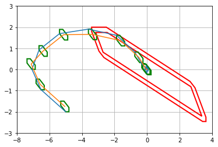

# robust_MPC
Repository for various robust MPC

### 1. Paper "Robust model predictive control of constrained linear systems with bounded disturbances"

Realize the application in this paper by using the python tool pytope. Tube-based robust MPC.

